<h1 align="center">The Home Learning Hub</h1>

## Index - Table of Contents

*  [Purpose](#purpose)
*  [User Experience](#user-experience)
*  [Design](#design)
*  [Technologies Used](#technologies-used)
*  [Testing](#testing)
*  [Deployment](#deployment)
*  [Credits](#credits)

# Purpose

Working in schools, during the Covid19 pandemic, gave me a unique insight into the challenges that teachers, parents and pupils all faced with regards to remote learning. Whilst many companies were quick to meet the demands of schools, many of these products were focussed on satisfying larger audiences and were rarely bespoke for each individual school and their needs. These websites offered libraries of generic resources, but lacked a sense of community, professional dialogue, and the ability to rapidly change the resources on offer to suit pupils' needs. 

With the Home Learning Hub, my goal has been to create an online learning platform which serves as a 'hub' for the school, parents and (as an extension) pupils of a specific school. It was clear from recent years that the profession has needed to rapidly adapt and re-evaluate how we can positivly affect change in pupil's lives, and that the process of 'home-learning' should not only be resigned to extreme circumstances, but instead be used as an on-going tool. My goal would be for The Home Learning Hub to not only support the education of pupils but also: enhance pupil wellbeing, provide efficient communication betwen school and home, boost parent confidence, and continue to instil a sense of 'school community'.

# User Experience

## Objectives of the Project:

1. To produce the **MVP** (minimum viable product), that allows `users` (parents) to interact with `admins` (school administration) by booking consultation appointments and accessing a 'resource library' populated by the child's school.
2. To enable `users` to access the booking process and the resource library with ease and without the requirement of supplying credentials.
3. To allow `admins` to register and access authorised areas of the site - including the ability to manage appointments and upload resources to the library.

## Target Audience

The main target audiences for the site are `school administrators` (who can provide access to teachers) and `parents`. The website needed to be functional for both of these user groups and their different needs.

### Parents (users) needs:
- **Simple design** - focussing on being a welcoming space whilst not detracting from the main purpose of the site.
- **Accessibility** - simple navigation, supported by minimal user steps to accomplish goals.
- **Communication** - clear and present feedback to reassure the user of their actions and success with achieving goals.

### School administraion (admins) needs:
- **Unique Access** - authorisation present to open up restricted pages dedicated to managing data and admin privaleges.
- **Functionality** - the managing of appointments and the uploading of resources needs to be simple, quick and fit-for-purpose.
- **Defensive Measures** - any edits or deletions are met with additional checks to ensure data is not accidentally altered.

## Functionality Requirements

All user stories and tasks related to the functionality of the site can be viewed in this project's [kanban board](https://github.com/users/NickdevC/projects/4), where all issues are clearly labelled and categorised to give context. The majority of these are displayed below, seperated into the different user types: `User`, `Admin`, and `Super Admin`.

### Unauthorised (`User`) Access

| User Story Link | Requirement |
| ----- | -------- |
| [#1](https://github.com/NickdevC/Home-Learning-Hub/issues/1#issue-1562209793) | I am able to easily recongise and understand the purpose of the site from the immediate information on the landing page |
| [#2](https://github.com/NickdevC/Home-Learning-Hub/issues/1#issue-1562209793) | I am able to easily navigate across the site, following clear signposting and using the minimal amount of clicks |
| [#3](https://github.com/NickdevC/Home-Learning-Hub/issues/1#issue-1562209793) | I am able to identify clear branding and consistency in design, providing me with confidence in site's purpose |
| [#4](https://github.com/NickdevC/Home-Learning-Hub/issues/6#issue-1562266464) | I am able to quickly and efficiently book an appointment with my child's teacher |
| [#5](https://github.com/NickdevC/Home-Learning-Hub/issues/24#issue-1587496408) | I receive confirmation feedback when submitting the appointment form to ensure my confidence in it's delivery |
| [#5](https://github.com/NickdevC/Home-Learning-Hub/issues/29#issue-1599713517) | I am challenged when inputing incorrect information into the appointment form and are given clear directions on how to remedy the fault |
| [#6](https://github.com/NickdevC/Home-Learning-Hub/issues/11#issue-1562295415) | I can access a 'resources library', displaying free resources to support my child's learning |
| [#7](https://github.com/NickdevC/Home-Learning-Hub/issues/34#issue-1599961263) | I can download a resource and have the file open as a pdf file in a seperate tab |

### Authorised (`Admin`) Access

#### Note regarding security: 
*Schools will have strict GDPR regulations in place to ensure the sharing and processing of data is safe and monitored. Where data is accessed by `Admins` assume that the school's policy is agreed by all staff who have access. Any user story item that requires this consideration has been flagged with a `security` tag.* 

| User Story Link | Requirement |
| ----- | -------- |
| [#1](https://github.com/NickdevC/Home-Learning-Hub/issues/1#issue-1562209793) | I am able to access the landing page and easily access a login page link |
| [#2](https://github.com/NickdevC/Home-Learning-Hub/issues/2#issue-1562233203) | With a link from a `superuser`, I can access a signup page and register my details to create an account |
| [#3](https://github.com/NickdevC/Home-Learning-Hub/issues/4#issue-1562252150) | I am able to navigate to a login page where I can input my details and successfully login to the site |
| [#4](https://github.com/NickdevC/Home-Learning-Hub/issues/4#issue-1562252150) | On successfully logging in, I am redirected to the homepage where added accessibility is now visible on the nav bar |
| [#5](https://github.com/NickdevC/Home-Learning-Hub/issues/5#issue-1562258527) | I am able to logout of my account in order to maintain security on my system |
| [#6](https://github.com/NickdevC/Home-Learning-Hub/issues/5#issue-1562258527) | I am presented with a modal message to add an extra level of defensive programming. I must confirm my logout process before being returned to the landing page |
| [#7](https://github.com/NickdevC/Home-Learning-Hub/issues/23#issue-1574501441) | I can access an 'Appointments' page, where all booked appointments are displayed `security` |
| [#8](https://github.com/NickdevC/Home-Learning-Hub/issues/7#issue-1562279581) | I can edit individual appointment bookings, changing any of the fields entered by the user `security` |
| [#9](https://github.com/NickdevC/Home-Learning-Hub/issues/8#issue-1562284295) | I can permanently delete individual appointment bookings from the 'Appointments' page |
| [#10](https://github.com/NickdevC/Home-Learning-Hub/issues/8#issue-1562284295) | On selecting to delete an appointment booking, I am faced with an added layer of defensive programming and must confirm the process through a modal popup message |
| [#11]() | 

### Specific `Super Admin` Access

| User Story Link | Requirement |
| ----- | -------- |
| [#1](https://github.com/NickdevC/Home-Learning-Hub/issues/13#issue-1562306829) | I can view all *booked appointments*, am able to edit these entries, and can use the data to monitor trends |
| [#2](https://github.com/NickdevC/Home-Learning-Hub/issues/35#issue-1599969836) | I can view all *uploaded reosurces*, am able to edit these entries, and can use the data to monitor trends |

### Developer Tasks 
*Here I have documented *some* of the tasks I created to demonstrate my agile approach to development. These tasks helped to fulfill the user stories listed above and demonstrate how the process was constant dialogue between the user/admin's needs and the site's functionality in practise.*

| Dev Task Link | Details |
| ----- | ------- |
| [#1](https://github.com/NickdevC/Home-Learning-Hub/issues/15#issue-1562317742) | Install Django and supporting libraries |
| [#2](https://github.com/NickdevC/Home-Learning-Hub/issues/16#issue-1562321869) | Install Bootstrap V5 for added responsiveness and functionality |
| [#3](https://github.com/NickdevC/Home-Learning-Hub/issues/19#issue-1564048600) | Create base.html template using Bootstrap syntax and including boilerplate |
| [#4](https://github.com/NickdevC/Home-Learning-Hub/issues/18#issue-1562326734) | Create an 'Appointment' model including all required fields for a user's details |
| [#5](https://github.com/NickdevC/Home-Learning-Hub/issues/27#issue-1591558422) | Create a new 'resources_app' within Django to setup the resources page structure and functionality |

# Design

## Agile Approach

I followed the 'agile' approach to developing my The Home Learning Hub, using the content from Code Institute's course content to support me. Initially, I used the Github 'issues' feature to create my `Must Have` features (displayed as user stories). Once these were established, and with consideration to my project's timetline, I considered and added a number of `Could Have` features that were not essential for the **MVP**. In addition, I created a [kanban board](https://github.com/users/NickdevC/projects/4) which I used throughout the development process. As I began planning out my sprints, I realised that I needed to include an extra column in my kanban board for styling, which meant that I could prioritise the functionality and database structuring *before* I focussed attention on styling the front-end elements (this could happen at the end). In addition, whilst working through sprints, and ensuring I met the criteria for various user stories, I found it useful to create 'Tasks' to detail specifc, more significant jobs.

Whilst the agile approach itself is more commonly based in team environments, with multiple people working on a project, this was hard to achieve as my project was my sole responsibility. To attempt to combat this 'coding in isolation', I reached out to a number of other people within the community to collaborate by: reviewing code, discussing bugs, problem solving user features and giving regular progress updates. The details of these collaborators can be found in the [Acknowledgements](#acknowledgements) section at the bottom of this readme.

## Technical Design

### Data Structure (models)

In planning my data structure, I used [Lucidchart](https://www.lucidchart.com/pages/) to help visualise the models and understand the various field types necessary for each data entry. My project consists of two main models (`Appointment` and `Resource`), with each requiring some additional `CHOICE` fields. In addition to this, the `Resource` model required a specific `CloudinaryField` to access my remote-hosted media for the site, as well as providing cloud storage for any files uploaded through the front-end.

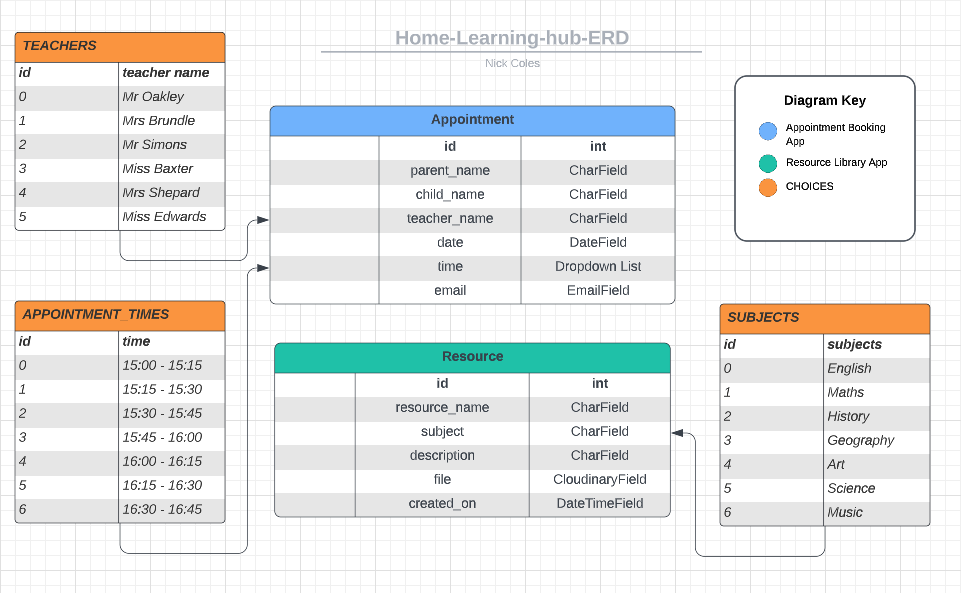

### Django App Structure

The Home Learning Hub app is seperated into two apps, each serving a different purpose: 'booking_app' and 'resources_app'. These apps are similar in structure but it was necessary to seperate them so that their individual functions could be isolated and accessed more readily for future maintence or duplication in other projects.

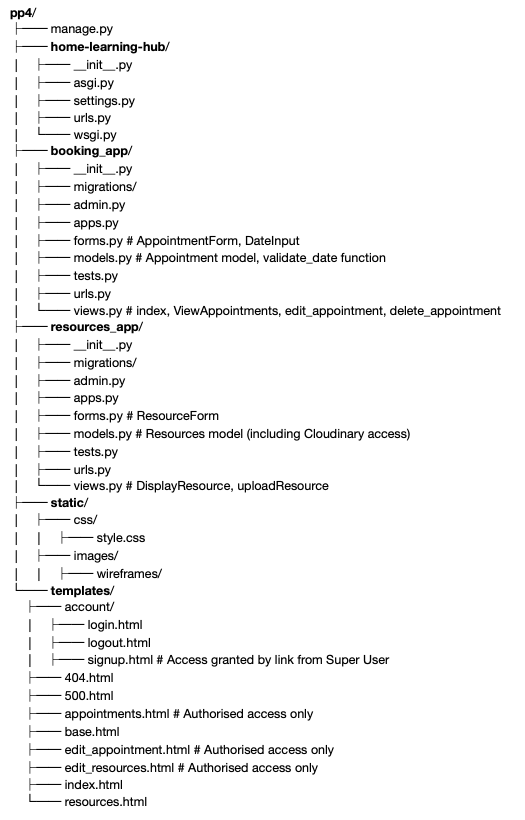

## UI Design

### Wireframes

#### Homepage

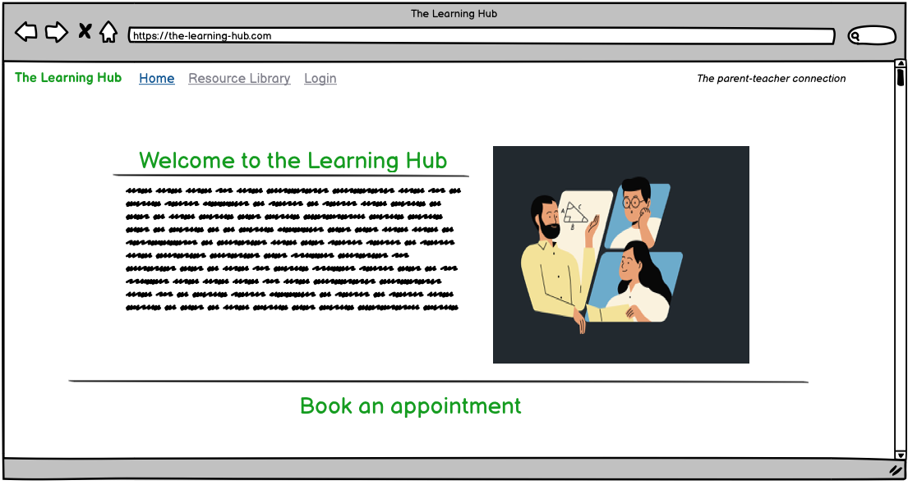

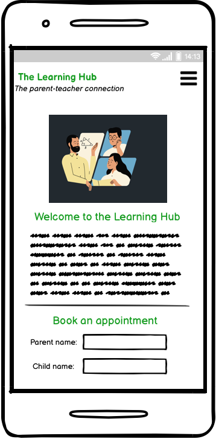

#### Resource Library

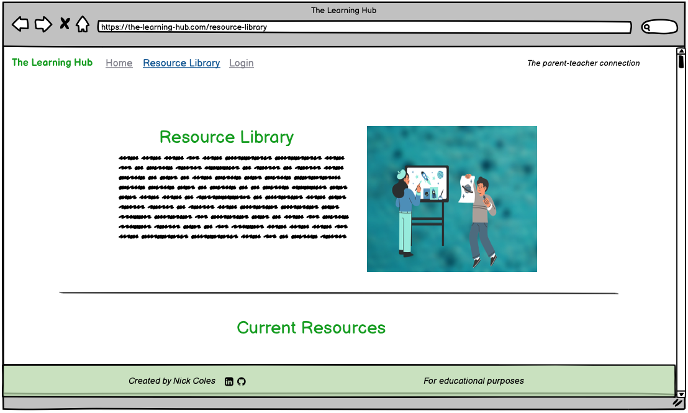
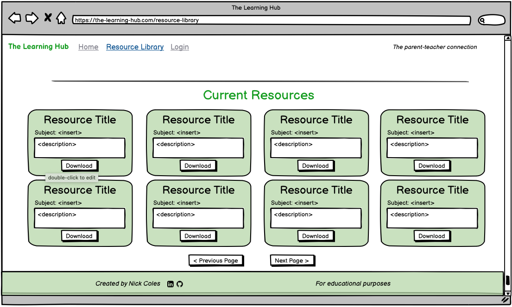
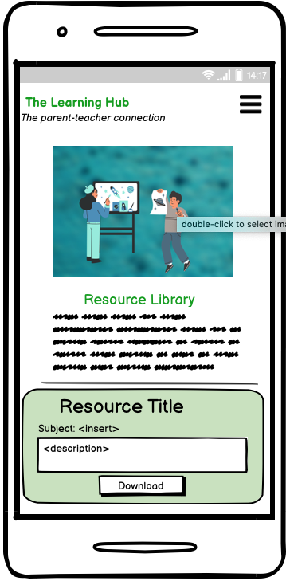

#### Login

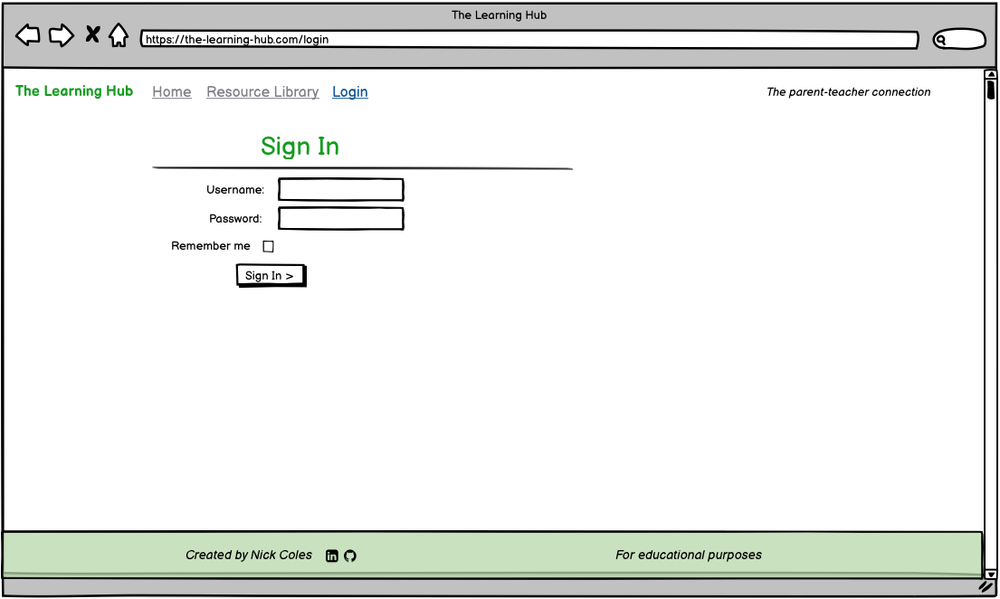

#### Appointments

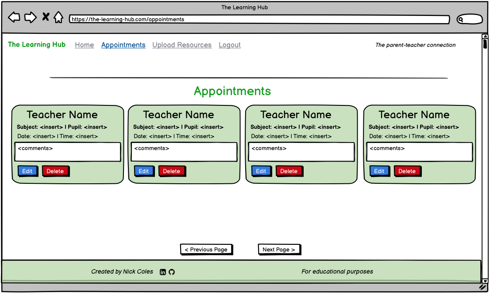
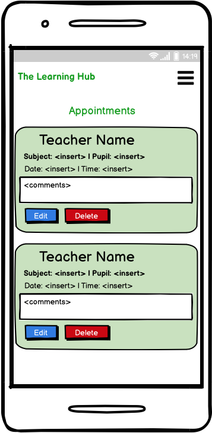

#### Edit Appointments

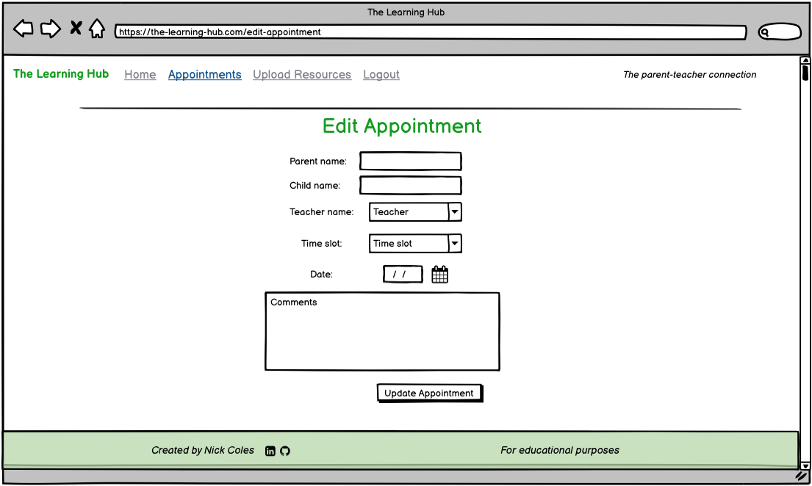

#### Upload Resource

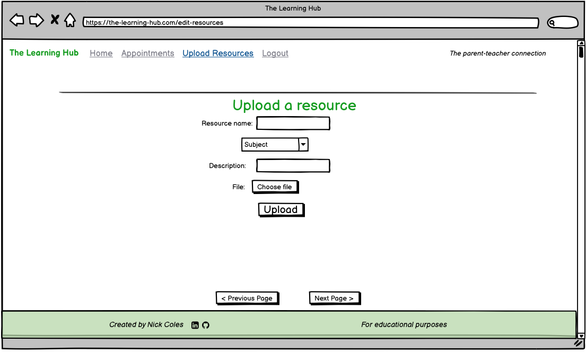

### Colour

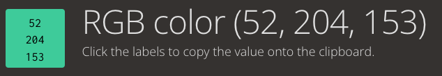

### Typography

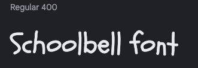

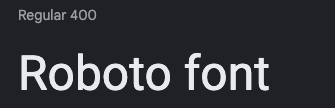

### Features 

#### Navbar (`user`)

* The navbar includes simple branding, in the form of the website logo (situated at the upper-left-corner). It is fully responsive and reduces to a 'burger menu' when screen size is reduced. In order to maintain a simple level of playfulness (often synonymous with schools), I have added minor user feedback in the form of a small 'drop' effect on each navbar item. In addition to this, I have used [Django Active-Link](https://django-active-link.readthedocs.io/en/latest/readme.html) to ensure that the navbar items are highlighted when 'active'.

#### Navbar (`admin`)

* The navbar for `admins` is much the same as `users`, with the addition of other authorised pages available to navigate to.

#### Footer (`user` and `admin`)

* The footer is a simple in it's design, following the same colour scheme as the rest of the site. I purposely did not add much styling to this as I wanted the main focus of the site to remain the **booking of appointments** and the **downloading of resources** for `users`. It includes simple social links to the developer, but could easily incorporate personalised social links for each individual school if the product became live.

#### Homepage (`user` and `admin`)

* The hero banner of the homepage was designed to be minimal, so as to not detract from the clear purpose and functionality of the site, whilst also feeling uncomplicated and non-threatening to a new user. The simple cartoon imagery provides a welcome and warm feel, whilst the small amount of text helps explain the purpose of the site. There is also the addition of a **call to action** button, which encourages users to access the **resource library**, reducing the amount of navigation required from the user to reach their goals.

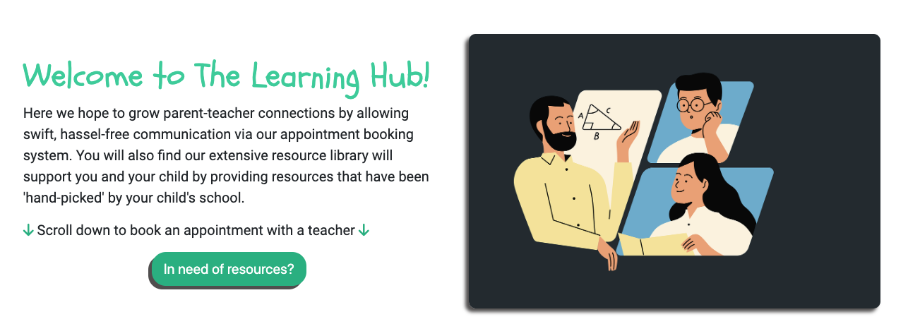

* The appointment form can be filled in by any visitor to the site, and you do not require a login to access it (whilst this may be something to change in the future for security purposes and to filter out unecessary communication, for now it fulfills the minimal requirements for the site). It allows the user to input all necessary fields to book an appointment with their child's teacher. A dropdown menu provides a list of `choices` for both the *teacher* and *time* options. In addition, there is a `date field` which allows the suer to pick a date for the appointment. I have ensured that the form cannot accept duplicate teacher/time/date slots, and will also prevent the user from booking a date in the past. See [bugs section](#bugs) for more details.

* This user interaction also forms the first part of the `CRUD` design, that being the `CREATE` stage.

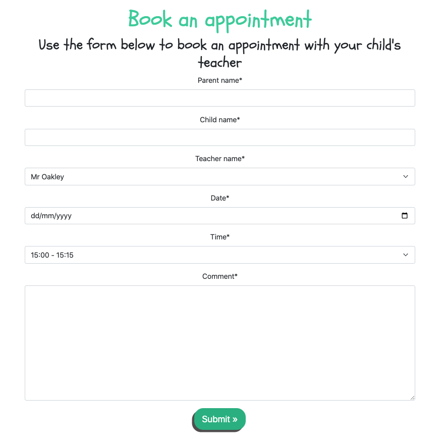

#### Appointment Form Alerts (`user` and `admin`)

* On successfully filling in the 'appointments form', the following alert message appears in order to give the user instant feedback and reassure them that the form has been recieved by the school. After 3 seconds, the alert disappears and the user is back on the homepage.

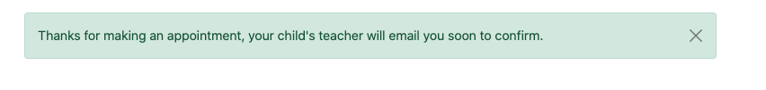

* If the form is filled in using a date from the past, the following error alert message appears at the top of the page. This gives the user a clear indication of what fields to check before rectifying the issue. **The form is not submitted until the issue is resolved.**

* In addition, the `date field` displays the following error to make it even clearer to the user.

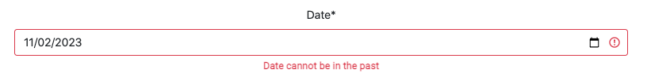

* If the user enters a combination of teacher/date/time where another entry already exists within the database, the following alert appears at the top of the page. This prompts the user to change their selection before continuing. **The form is not submitted until the issue is resolved.**

#### Resource Library (`user`)

* On entering the 'Resource Library' page, `users` are met with another hero banner, designed to present a welcoming feel and promote accessibility. The image is in-line with the homepage in terms of branding, and the accompanying text helps to explain the purpose and role of the page itself.

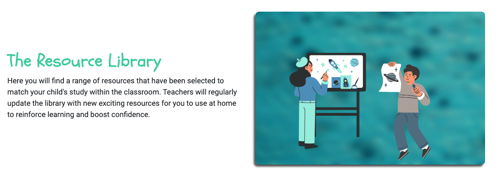

* The 'Resource Library' page displays all uploaded resources for `users` to access and download (opening in a seperate tab). These resources appear in small, simple cards, displaying only the most vital information. Pagination is in place to ensure that the screen does not become overcrowded with further resources being added. 

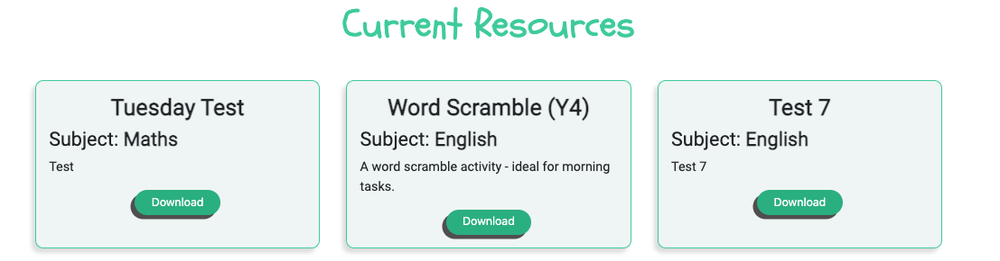

#### Login (`user` and `admin`)

* This page is open to all users, however only `admins` have the ability to supply credentials here and open up other parts of the site. There is a text prompt which instructs users to contact their school administrator for login details (please see next 'Sign Up' section).

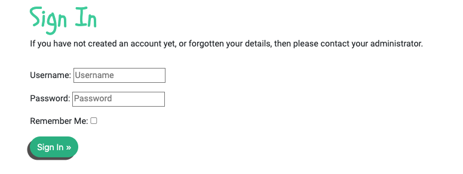

#### Sign Up (`admin`)

**Important! This page is a hidden template, and would be issued by the main school administrator (`Super User`) for other administration staff (`admins`) to access.** [Please find the page here]()

* This sign up page displays a clear, uncomplicated sign up form, supported by [Django's AllAuth applications](https://django-allauth.readthedocs.io/en/latest/). It allows school administration staff to sign up and create secure accounts to access restricted pages within the site.

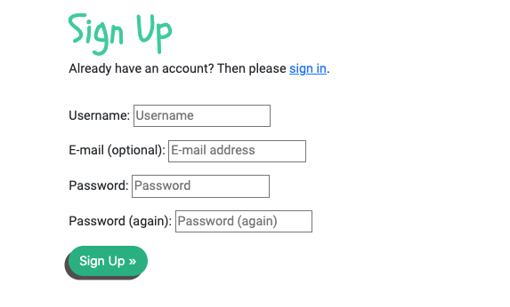

#### Appointments (`admin`)

* On successfully signing in, `admins` have access to the 'Appointments' page, where they can manage the appointments made by `users`. Here, the details of each individual appointment are clearly displayed in small cards. Again, with functionality in mind, the level of styling is minimal here as any more refinement may detract from the sole purpose of the app, and the goals of the `admins`. Each appointment also contains buttons for 'Edit' and 'Delete'. Pagination is in place to ensure that the screen does not become overcrowded with further appointments being added.

* This user interaction also forms the second part of the `CRUD` design, that being the `READ` stage.

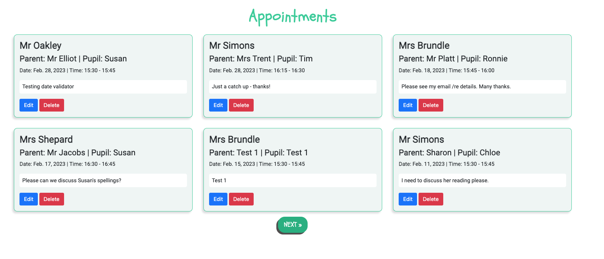

* On selecting 'Edit', `admins` are taken to the 'edit_appointment' template and can update any of the details for the appointment before saving these changes and being returned to the 'Appointments' page.

* This user interaction also forms the third part of the `CRUD` design, that being the `UPDATE` stage.

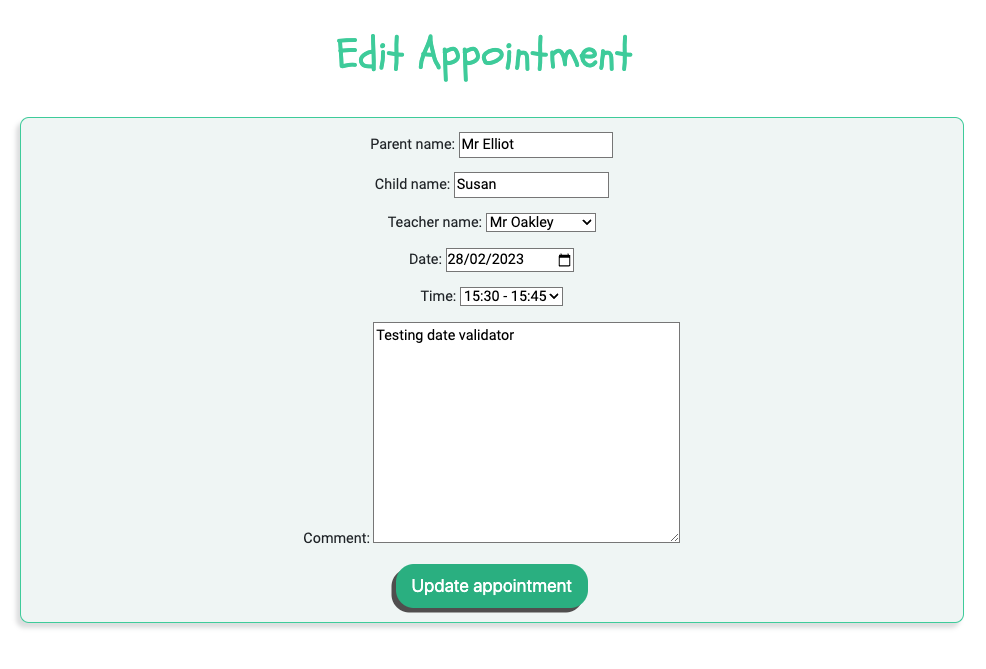

* On selecting 'Delete', `admins` are presented with a modal, used as an element of defensive programming, in order to confirm the action before permanently deleting the appointment from both the front-end view and the database. On confirming the deletion, they are returned back to the 'Appointments' page.

* This user interaction also forms the fourth part of the `CRUD` design, that being the `DELETE` stage.

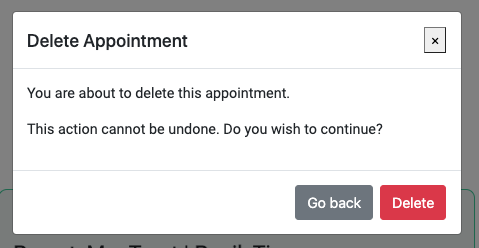

#### Upload Resources (`admin`)

* The 'Upload Resources' page provides `admins` with a form which allows them to upload resources for `users` to use at home to support their child's learning. Here you can specify the name of the resource, the subject and with the `CloudinaryField`, all uploaded resources are stored in the [Cloudinary database](https://cloudinary.com/), and then rendered in the 'Resource Library' page for all `users` to access. 

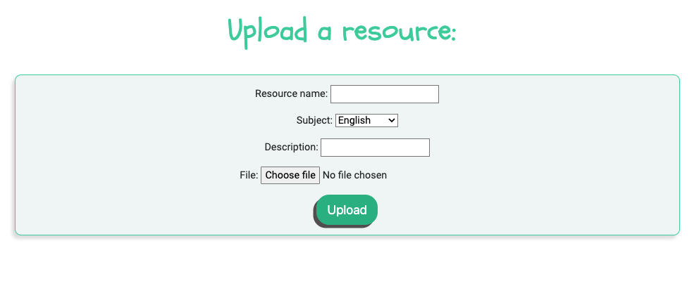

# Technologies Used 

## Languages
* [HTML](https://developer.mozilla.org/en-US/docs/Learn/Getting_started_with_the_web/HTML_basics) - The markup language used to create the structure of the site.
* [CSS](https://developer.mozilla.org/en-US/docs/Web/CSS) - Used to style elements of the site.
* [JavaScript](https://www.javascript.com/) - Used to add interactivity to elements of the site.
* [Python](https://www.python.org/) - Primary language used to develop the back-end portions of the site.

## Frameworks/libraries
* [Django](https://www.djangoproject.com/) - Python web framework providing pre-built syntax structures and providing essential 'app' file structures.
  - [Django AllAuth](https://django-allauth.readthedocs.io/en/latest/) - Integrated set of Django applications addressing authentication, registration, and account management.
  - [Django Summernote](https://github.com/summernote/django-summernote) - A simple WYSIWYG editor for use with Django.
  - [Django CrispyForms](https://django-crispy-forms.readthedocs.io/en/latest/) - Gives added control and choices with regards to the rendering behavior of Django forms.
  - [Django Active-Link](https://django-active-link.readthedocs.io/en/latest/readme.html) - A simple way to highlight active links in a Django app.

## Databases
* [ElephantSQL](https://www.elephantsql.com/) - Database used to store all models and user-generated data.
* [Cloudinary](https://cloudinary.com/) - Cloud database for storing images and uploaded files from the front-end of my app.

## Other Tools
* [Heroku](https://www.heroku.com/) - A cloud platform used for hosting the app.
* [Github](https://github.com/github) - Used to host my app's source code. Also provided the tools for creating *issues* and a *kanban board* for my agile approach to development.
* [Git](https://git-scm.com/) - Git is an open source distributed version control system used to manage all code.
* [Pip3](https://pypi.org/project/pip/) - The package installer for Python, used to install packages from the Python Package Index and other indexes.
* [Gunicorn](https://gunicorn.org/) - Gunicorn 'Green Unicorn' is a Python WSGI HTTP Server for UNIX (translates HTTP requests for Python to understand).
* [Pyscopg2](https://pypi.org/project/psycopg2/) - PostgreSQL database adapter for Python.
* [VScode](https://code.visualstudio.com/) - A code editor redefined and optimized for building and debugging modern web and cloud applications. 
* [Chrome Dev Tools](https://developer.chrome.com/docs/devtools/) - A set of web developer tools built directly into the Google Chrome browser. Used to help debug my code during development.
* [Google Fonts](https://fonts.google.com/) - A font catalogue, providing a variety of free custom fonts.
* [Font Awesome](https://fontawesome.com/) - An online icon library, used to provide small icons for social links and navigation functions.
* [Balsamiq](https://balsamiq.com/wireframes/) - Used to create wireframes of the site during planning stages.
* [Lucidchart](https://www.lucidchart.com/pages/) - Used to create and display model structures.

# Testing

## User Testing

## Admin Testing

## Super Admin Testing

## Performance Testing

## Bugs

| Link to Bug | Description | Solution |
| ----- | -------- | ------- |
| [#1](https://github.com/NickdevC/Home-Learning-Hub/issues/21#issue-1574485639) | Choices within a CharField were rendering as numerical values rather than strings | Used the 'get_FOO_display' method [Stack Overflow](https://stackoverflow.com/questions/49091870/django-template-force-choices-on-field-and-print-display-value-with-get-foo-dis) |
| [#2](https://github.com/NickdevC/Home-Learning-Hub/issues/22#issue-1574493640) | TextField displays html tags along with the content itself to the user | Add the 'safe' tag to my TextField variables [Django Project](https://docs.djangoproject.com/en/1.8/ref/templates/builtins/#safe) |
| [#3](https://github.com/NickdevC/Home-Learning-Hub/issues/25#issue-1587902889) | The delete modal would not display when users clicked the 'delete' button | Found small syntax differences between Bootstrap 4 and 5. I needed to update to the V5 syntax 'data-**bs**-dismiss=' and link this in my urls.py file |
| [#4](https://github.com/NickdevC/Home-Learning-Hub/issues/26#issue-1589889951) | Users were able to book duplicate appointments with the same teacher/date/time data | I added the 'unique_together' attrib in the model [Stack Overflow](https://stackoverflow.com/questions/25170071/how-do-i-use-unique-together-in-django) |
| [#5](https://github.com/NickdevC/Home-Learning-Hub/issues/33#issue-1599959933) | Users were able to book an appointment using a date from the past | I created and added a custom validator to the Appointment model [Django Project](https://docs.djangoproject.com/en/2.2/ref/validators/) |
| [#5](https://github.com/NickdevC/Home-Learning-Hub/issues/30#issue-1599717586) | When users navigated through different pages, the navbar was unresponsive and did not display any 'active' status | I installed Django Active-Links and added the additional code to the nav-links [Django-Active-Links](https://django-active-link.readthedocs.io/en/latest/readme.html) |
| [#6](https://github.com/NickdevC/Home-Learning-Hub/issues/31#issue-1599718423) | When uploading a file through the admin panel, the file is visible in Cloudinary storage but does not appear to the user on the front-end | I needed to add '.url' to the href in the 'Resource Library' template |
| [#7](https://github.com/NickdevC/Home-Learning-Hub/issues/32#issue-1599959327) | When uploading a file from the front-end, the files in question would not appear in Cloudinary storage | I needed to pass ‘request.FILES’ to the ResourceForm [Django Project](https://docs.djangoproject.com/en/4.1/topics/http/file-uploads/) |

# Deployment

# Credits

## Websites

## Acknowledgements

